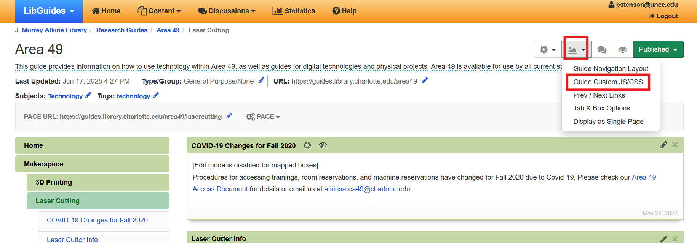
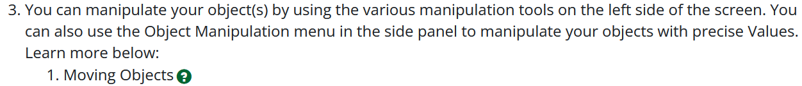
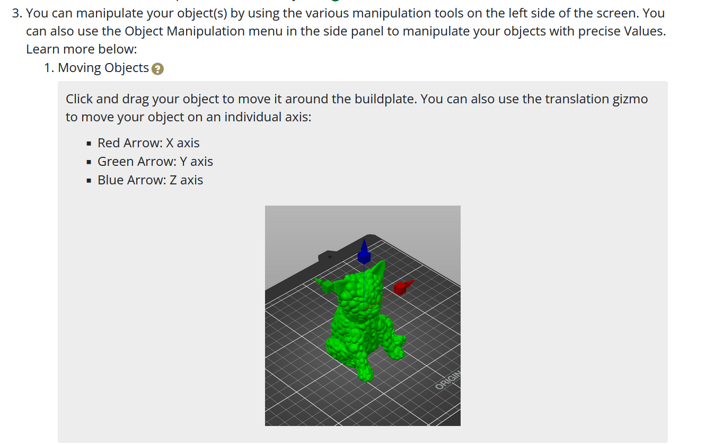
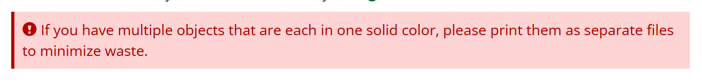
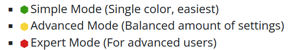
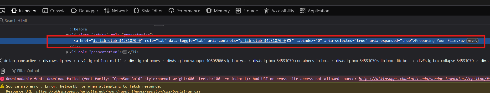

# A49 Libguide Custom Code Documentation
Here's how to use the custom code stuff I made for our libguide!
# Linking external CSS File
For any of this to work or look even remotely good, you need to copy and paste a reference to this custom CSS into your libguide's Custom CSS/JS Box.

To find this box:
1. On the editing page for your libguide, find and click on the Look and Feel Icon, then Click "Guide Custom CSS/JS."

2. Paste the following code:
```
<link rel="stylesheet" type="text/css" href="https://atkinsarea49.github.io/libguideRepo/css/libguideCSS.css">
```
# Adding Custom Elements
Most of these techniques require you to edit the source code for your content items. In the rich text editing window, click the "Source" icon. This will show you the bare (and horribly linted) HTML. It can look a little all over the place, so here are some general tips for reading it. **IT IS HIGHLY ADVISABLE TO COPY ALL OF YOUR SOURCE CODE AND PASTE IT IN A TEMPORARY LOCATION BEFORE SWITCHING FROM SOURCE CODE TO RICH TEXT MODE OR BEFORE CONFIRMING YOUR CHANGES.** The libguide editing page performs "validation" (if you can even call it that) on the code, and if it detects any errors, it will try and guess at what you were trying to do and "fix it" itself (and it WILL guess wrong).
- Most HTML elements have an opening and closing tag that tells the computer where the element starts and begins. These tags look like this:
```
<p>Your content here!</p>
```
- Notice how the closing tag has a `/` before the element's name.
- You can nest multiple elements inside each other.
- Some elements like images only have a singular tag, which looks like this:
```

```
- Notice that instead of a closing tag, this image element has a `/>` at the end.
- This element also has attributes (`href="blahblahblah.com/image"` and `alt="Alternate text"`), which are little bits of text that tell the computer how to display the element. These are usually in the opening tag.
- [Read more about HTML elements here](https://www.w3schools.com/html/html_elements.asp)
## Details Dropdown
This element will put a question mark icon wherever you paste the code that opens a collapsing box for images/more details/explanations/etc. It looks best when placed at the end of a line. It is classed as a button and styled to look a little better inline.


1. Copy and paste the following code at the end of a text element like `<p>` (paragraph) or `<li>` (list item). You can also put these at the end of headings like `<h2>` or `<h3>`. Paste the code **before** the closing tag (the tag with the `/` before the name, such as `</p>` or `</h3>`.
```
<button aria-controls="[ID HERE]" aria-expanded="false" aria-label="[LABEL HERE]" class="btn btn-default question-btn" data-toggle="collapse" href="#[ID HERE]" title="[TOOLTIP HERE]">
    <span class="glyphicon glyphicon-question-sign"></span>
</button>
<div class="collapseBox collapse" id="[ID HERE]">
   <p>[PLACE YOUR CONTENT HERE]</p>
</div>
```
2. You will need to replace several things in this code. Replace the following text **including the brackets**, but do not remove the quotes.
  - **[ID HERE]** - This should be a unique identifier for your dropdown box. All lowercase, use hyphens instead of spaces, no special characters.
    - e.g. `aria controls="simple-mode-explanation"`
    - e.g. `href="#simple-mode-explanation"`
      - Note: the href needs to have the `#`, so be sure to leave that be when filling this in.
    - e.g. `id="simple-mode-explanation"`
  - **[LABEL HERE]** - This is an Aria label, which is what a screen reader will read aloud when the user selects the button. Try to use something descriptive but short. Use spaces in this one, but limit special characters.
    - e.g. `aria-label="Simple mode explanation"`
  - **[TOOLTIP HERE]** - This is the little tiny text that pops up when you hover over an element. This is usually not seen by screen readers or mobile users, so it's best not to put any essential information here.
    - e.g. `title="More information"`
  - **[PLACE YOUR CONTENT HERE]** - Add the stuff you want displayed in the collapsable box here. You can add other elements outside the `<p>` tags as well such as lists and images, as long as everything stays within the `<div>` tags.
    - If you are not familiar with HTML and you want to add stuff beyond plain text, I'd recommend adding it using the rich text editor at the bottom of the page, then cutting and pasting the source code between the two `<div>` tags.
    - If you need multiple paragraphs, add your additional paragraphs after the closed `</p>` tag enclosed with a `<p>` tag at the beginning and a `</p>` tag at the end.

You can also do a similar technique with plain text links, other buttons, etc. Here is an example of a dropdown that uses a plain text link:
```
<a aria-controls="[ID HERE]" aria-expanded="false" aria-label="[LABEL HERE]" data-toggle="collapse" href="#[ID HERE]" title="[TOOLTIP HERE]">
	[LINK TEXT HERE]
</a>
<div class="collapseBox collapse" id="[ID HERE]">
   <p>[PLACE YOUR CONTENT HERE]</p>
</div>
```
Note that this is pretty similar, except the `<a>` tag does not have a class attribute (since it's not a button and is instead a link). Also, you will need to replace the `[LINK TEXT HERE]` text with whatever you want the link to say.
## Alert Box
This is a box of text designed to catch the user's attention with bolder text and different coloring. The Exclaimation point icon contains an Aria label that screen readers will read aloud as "Alert." This is designed to draw the user's attention to important notes/safety notices.

1. Copy and paste the following code wherever your want your alert box to be. It is recommended not to place it inside any inline elements (mostly text elements like `<p>` and such).
```
<div class="alertBox">
   <p>
      <span class="glyphicon glyphicon-exclamation-sign" aria-label="Alert"></span>
      [YOUR MESSAGE HERE]
   </p>
</div>
```
2. Replace the **[YOUR MESSAGE HERE]** text with your text. It is not recommended to put anything other than text here.
## Prusa Mode Icons
These are small icons to indicate the settings level that a user will need to have enabled in PrusaSlicer in order to see the indicated settings. This is a specific use case meant for the 3D printing libguide.

1. Paste one of these anywhere you need to indicate a settings mode, ideally at the beginning of an element right after the opening tag. You don't need to change anything.
### Simple Mode
```
<svg class="mode-icon simple-mode-icon" data-name="Simple Mode Icon" viewbox="0 0 11.44 13.21" aria-label="Simple Mode" xmlns="http://www.w3.org/2000/svg" style="height: 12px; width: auto;"> <polygon points="11.44 9.91 11.44 3.3 5.72 0 0 3.3 0 9.91 5.72 13.21 11.44 9.91"></polygon> </svg>
```
### Advanced Mode
```
<svg class="mode-icon advanced-mode-icon" data-name="Advanced Mode Icon" viewbox="0 0 11.44 13.21" aria-label="Advanced Mode" xmlns="http://www.w3.org/2000/svg" style="height: 12px; width: auto;"> <polygon points="11.44 9.91 11.44 3.3 5.72 0 0 3.3 0 9.91 5.72 13.21 11.44 9.91"></polygon> </svg>
```
### Expert Mode
```
<svg class="mode-icon expert-mode-icon" data-name="Expert Mode Icon" aria-label="Expert mode" viewbox="0 0 11.44 13.21" xmlns="http://www.w3.org/2000/svg" style="height: 12px; width: auto;"> <polygon points="11.44 9.91 11.44 3.3 5.72 0 0 3.3 0 9.91 5.72 13.21 11.44 9.91"></polygon> </svg>
```
# Formatting Tricks
Some of the formatting on the public libguide can be a little finicky, so I've also included some instructions on how to get around some of these quirks.
## Image Formatting
For these, I recommend adding your image in the rich text editor, then cutting and pasting/altering the code in the source code editor.
### Centering Images
For some reason, images don't center themselves on the public libguide like they do on the editing page. 
1. To fix this, add this attribute inside the `` tag of your desired image.
```
class="centerimage"
```
### Adding one or more Images in a Row (or with Captions)
This one is a little more complicated, but the images will align nicely with the captions. You can use this to either put multiple images in a row, add a caption to an image that conforms to the image's size, or both.
1. Copy and paste this code wherever you want your image(s) to be placed.
```
<div style="margin-left:auto !important; margin-right:auto !important; width:fit-content;">
	<div class="imagerow">
		<p>[PLACE IMAGE HERE]</p>
		<p class="caption">[PLACE CAPTION HERE]</p>
	</div>
</div>
```
2. You can increase the number of images that are placed next to each other by adding this code after the second to last `</div>` closing tag.
```
<div class="imagerow">
    <p>[PLACE IMAGE HERE]</p>
    <p class="caption">[PLACE CAPTION HERE]</p>
</div>
```
So if you had two images, it would look like this:
```
<div style="margin-left:auto !important; margin-right:auto !important; width:fit-content;">
	<div class="imagerow">
		<p>[PLACE IMAGE HERE]</p>
		<p class="caption">[PLACE CAPTION HERE]</p>
	</div>
	<div class="imagerow">
		<p>[PLACE IMAGE HERE]</p>
		<p class="caption">[PLACE CAPTION HERE]</p>
	</div>
</div>
```
3. Replace the indicated text **including the brackets**, but do not remove the quotes.
   - **[PLACE IMAGE HERE]** - Copy and paste your image element in between the `<p>` and `</p>` tags.
   - **[PLACE CAPTION HERE]** - Type your caption here.
4. Repeat for each image.
5. If you don't want the caption, delete this line:
```
<p class="caption">[PLACE CAPTION HERE]</p>
```
**Tip:** Images placed in these rows look best when they are all the same height. By default, libguides adds the width and height in a style attribute, which can be changed after-the-fact in the source code if necessary. For this, change the width to `auto` and the height to any number of pixels: `200px`. 200-300 is usually good. You can do this for every image in that row to make them line up nicely.
```
style="width: auto; height: 200px;"
```
## Linking to Specific Tabs in Tabbed Boxes
I have no idea why this isn't a thing you can do. If you want to link to a specific tab in a tabbed box, use this code to create your link. Keep in mind this is a bit more involved and better suited for more advanced users.
1. Copy and paste this code wherever your want your link to be. This can be inline with other text or on its own. It does not matter.
```
<a class="tabLink" href="[LINK TO TABBED BOX]" onclick="jQuery('a[href=&quot;#[ID OF THE TAB]&quot;]').click();">LINK TEXT</a>
```
2. Replace the following text:
    - **[LINK TO TABBED BOX]** - Place the lnk to the box that your tab is in. You can get this in the box's individual settings.
    - **[ID OF THE TAB]** - BE VERY CAREFUL THAT YOU ARE ONLY REPLACING THIS TEXT.
        - **Getting the ID: Method 1**:
            1. On the public libguide, right click on the tab and click "Inspect Element."
            2. The box that appears will look different depending on the browser you're using, but in general it should bring up the website's raw HTML with the tab's line highlighted or indicated somehow.

            3. The value listed under `href` is the ID of the tab. Copy this value **without the `#` and the quotes** and use it as your ID.
            4. Your tabs IDs are made by appending a hyphen and a number that increases for each tab in order. The numbers start at 0.
			- e.g. If your tab's IDs start with `s-lib-ctab-34531070`, then:
			- Your first tab's ID will be `s-lib-ctab-34531070-0`
			- Your second tab's ID will be `s-lib-ctab-34531070-1`
			- Your third tab's ID will be `s-lib-ctab-34531070-2` and so on

**IMPORTANT: If you reoder your tabs, you will need to make sure you update your links to match the new order, since the tabs are numbered sequentially and not necessarily based on the individual tab itself**

