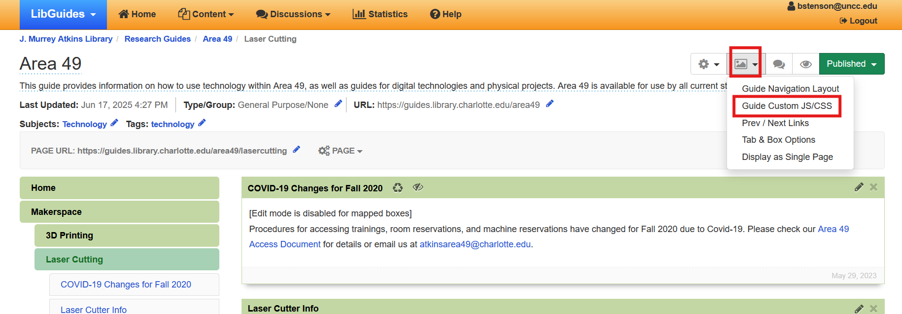

# A49 Libguide Custom Code Documentation
Here's how to use the custom code stuff I made for our libguide!
# Linking external CSS File
For any of this to work or look even remotely good, you need to copy and paste a reference to this custom CSS into your libguide's Custom CSS/JS Box.

To find this box:
1. On the editing page for your libguide, find and click on the Look and Feel Icon, then Click "Guide Custom CSS/JS."

2. Paste the following code:
```
<link rel="stylesheet" type="text/css" href="https://atkinsarea49.github.io/libguideRepo/css/libguideCSS.css">
```
# Adding Custom Elements
Most of these techniques require you to edit the source code for your content items. In the rich text editing window, click the "Source" icon. This will show you the bare (and horribly linted) HTML. It can look a little all over the place, so here are some general tips for reading it. **IT IS HIGHLY ADVISABLE TO COPY ALL OF YOUR SOURCE CODE AND PASTE IT IN A TEMPORARY LOCATION BEFORE SWITCHING FROM SOURCE CODE TO RICH TEXT MODE OR BEFORE CONFIRMING YOUR CHANGES.** The libguide editing page performs "validation" (if you can even call it that) on the code, and if it detects any errors, it will try and guess at what you were trying to do and "fix it" itself (and it WILL guess wrong).
- Most HTML elements have an opening and closing tag that tells the computer where the element starts and begins. These tags look like this:
```
<p>Your content here!</p>
```
- Notice how the closing tag has a `/` before the element's name.
- You can nest multiple elements inside each other.
- Some elements like images only have a singular tag, which looks like this:
```

```
- Notice that instead of a closing tag, this image element has a `/>` at the end.
- This element also has attributes (`href="blahblahblah.com/image"` and `alt="Alternate text"`), which are little bits of text that tell the computer how to display the element. These are usually in the opening tag.
- [Read more about HTML elements here](https://www.w3schools.com/html/html_elements.asp)
# Snippets
- [Details Dropdown](snippets/detailsdropdown.md)
- [Alert Box](snippets/alertbox.md)
- [Prusa Mode Icons](snippets/prusaicons)
- Formatting Tricks
- 	[Centering Images](snippets/centerimage.md)
- 	[Inline Images](snippets/inlineimages.md)
- 	[Placing Objects Next to Each Other](snippets/objectrow.md)
- [Linking to Specific Tabs in Tabbed Boxes](snippets/linkingtotabs.md)
- [Seek and Find/Scavenger Hunts](snippets/seekandfind.md)
- [FAQ Widgets](snippets/faq.md)
