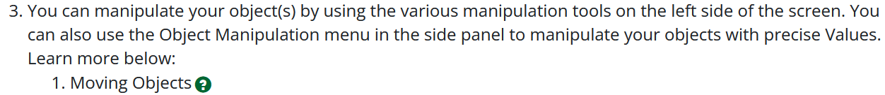
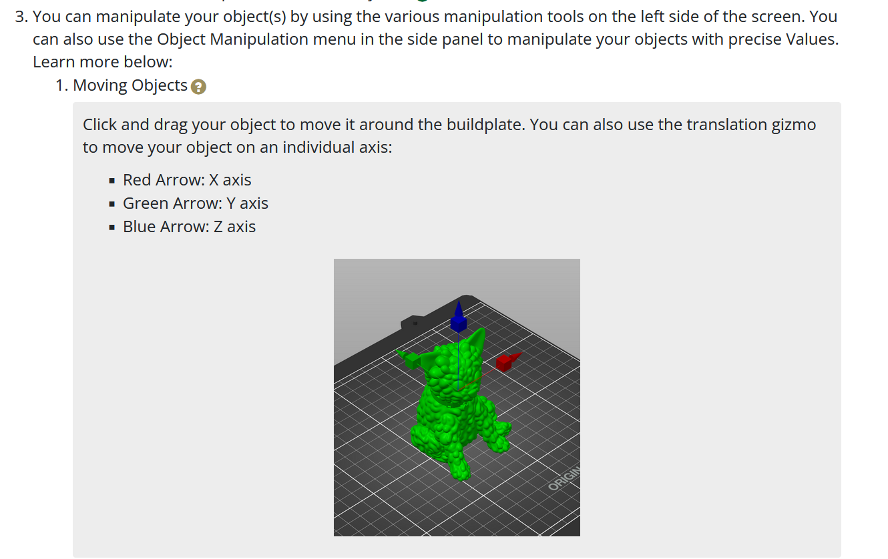

## Details Dropdown
This element will put a question mark icon wherever you paste the code that opens a collapsing box for images/more details/explanations/etc. It looks best when placed at the end of a line. It is classed as a button and styled to look a little better inline.


1. Copy and paste the following code at the end of a text element like `<p>` (paragraph) or `<li>` (list item). You can also put these at the end of headings like `<h2>` or `<h3>`. Paste the code **before** the closing tag (the tag with the `/` before the name, such as `</p>` or `</h3>`.
```
<button aria-controls="[ID HERE]" aria-expanded="false" aria-label="[LABEL HERE]" class="btn btn-default question-btn" data-toggle="collapse" href="#[ID HERE]" title="[TOOLTIP HERE]">
    <span class="glyphicon glyphicon-question-sign"></span>
</button>
<div class="collapseBox collapse" id="[ID HERE]">
   <p>[PLACE YOUR CONTENT HERE]</p>
</div>
```
2. You will need to replace several things in this code. Replace the following text **including the brackets**, but do not remove the quotes.
  - **[ID HERE]** - This should be a unique identifier for your dropdown box. All lowercase, use hyphens instead of spaces, no special characters.
    - e.g. `aria controls="simple-mode-explanation"`
    - e.g. `href="#simple-mode-explanation"`
      - Note: the href needs to have the `#`, so be sure to leave that be when filling this in.
    - e.g. `id="simple-mode-explanation"`
  - **[LABEL HERE]** - This is an Aria label, which is what a screen reader will read aloud when the user selects the button. Try to use something descriptive but short. Use spaces in this one, but limit special characters.
    - e.g. `aria-label="Simple mode explanation"`
  - **[TOOLTIP HERE]** - This is the little tiny text that pops up when you hover over an element. This is usually not seen by screen readers or mobile users, so it's best not to put any essential information here.
    - e.g. `title="More information"`
  - **[PLACE YOUR CONTENT HERE]** - Add the stuff you want displayed in the collapsable box here. You can add other elements outside the `<p>` tags as well such as lists and images, as long as everything stays within the `<div>` tags.
    - If you are not familiar with HTML and you want to add stuff beyond plain text, I'd recommend adding it using the rich text editor at the bottom of the page, then cutting and pasting the source code between the two `<div>` tags.
    - If you need multiple paragraphs, add your additional paragraphs after the closed `</p>` tag enclosed with a `<p>` tag at the beginning and a `</p>` tag at the end.

You can also do a similar technique with plain text links, other buttons, etc. Here is an example of a dropdown that uses a plain text link:
```
<a aria-controls="[ID HERE]" aria-expanded="false" aria-label="[LABEL HERE]" data-toggle="collapse" href="#[ID HERE]" title="[TOOLTIP HERE]">
	[LINK TEXT HERE]
</a>
<div class="collapseBox collapse" id="[ID HERE]">
   <p>[PLACE YOUR CONTENT HERE]</p>
</div>
```
Note that this is pretty similar, except the `<a>` tag does not have a class attribute (since it's not a button and is instead a link). Also, you will need to replace the `[LINK TEXT HERE]` text with whatever you want the link to say.
